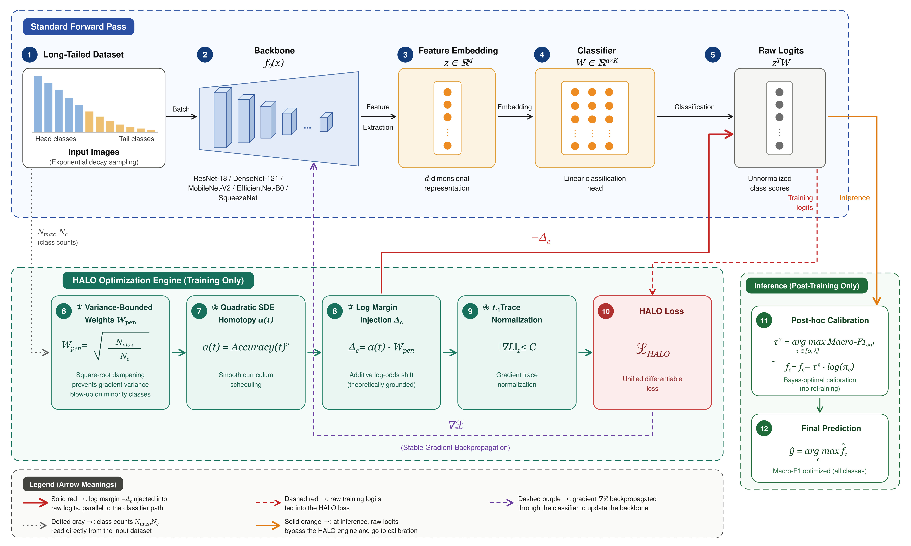

# HALO: Heuristic-Free Adaptive Long-Tail Optimization

[](https://wacv2027.ieeecomputer.org/)
[](https://opensource.org/licenses/MIT)
[](https://www.python.org/downloads/release/python-3120/)
[](https://pytorch.org/)

## Method Abstract

Long-tail visual recognition is still dominated by two-stage pipelines built on fixed epoch schedules, linear margin penalties, and manually tuned re-weighting heuristics. We introduce **HALO (Heuristic-Free Adaptive Long-Tail Optimization)**, a continuous framework in which each component is derived from a stated principle in optimization theory, statistical learning theory, and Bayesian decision theory rather than selected by search. We show that naive importance-sampling weights inflate the variance of the weighted gradient estimator on tail classes, and derive a square-root-dampened penalty base that restores an $\mathcal{O}(1/N_c)$ bound. We characterize the gradient shock of polynomial train-accuracy gating and show that the quadratic exponent is the lowest-order schedule whose shock vanishes at both ends of training while peaking at mid-trajectory, unlike linear gating (peak at initialization) or higher-order gating (a near-step transition at convergence). We show that a multiplicative correction of predicted class mass corresponds to an additive logarithmic shift in the log-odds domain, motivating a logarithmic rather than linear penalty. Finally, we derive a Bayes-optimal post-hoc calibration rule with an explicit bound on its temperature search range. Evaluated against eight baselines across five backbones and five benchmarks - coarse-grained (CIFAR-10/100-LT) and fine-grained (Oxford-IIIT Pets-LT, CUB-200-LT, and Stanford Cars-LT, the last with 1-2-shot tail classes) - HALO obtains the best Macro F1 in all 25 backbone-dataset configurations, with significantly narrower margins under extreme tail scarcity, a regime we analyze explicitly. Ablations confirm that each derived term contributes, with quadratic gating and $\ell_1$ trace normalization proving most critical to calibration stability.

## Method Architecture



## Long-Tailed Recognition Evaluation (Macro-F1)

All results are reported as Mean &plusmn; Standard Deviation over 3 independent training runs. Bold denotes the best performance.

### ResNet-18

| Method | CIFAR-10-LT | CIFAR-100-LT | Pets-LT | CUB-200-LT | Cars-LT |
|:---|:---:|:---:|:---:|:---:|:---:|
| WCE | 64.41 &plusmn; 0.61 | 36.11 &plusmn; 0.12 | 55.88 &plusmn; 0.32 | 17.67 &plusmn; 0.28 | 16.16 &plusmn; 0.69 |
| CB Loss | 64.94 &plusmn; 0.64 | 34.45 &plusmn; 0.81 | 56.18 &plusmn; 0.17 | 18.06 &plusmn; 0.44 | 16.66 &plusmn; 0.12 |
| Focal | 57.97 &plusmn; 0.27 | 34.12 &plusmn; 0.50 | 50.71 &plusmn; 0.12 | 17.82 &plusmn; 0.26 | 18.49 &plusmn; 0.62 |
| LDAM | 62.54 &plusmn; 0.54 | 32.72 &plusmn; 0.28 | 55.53 &plusmn; 0.57 | 19.63 &plusmn; 0.75 | 10.19 &plusmn; 0.11 |
| DBM | 66.54 &plusmn; 0.74 | 35.18 &plusmn; 0.66 | 55.98 &plusmn; 0.37 | 22.85 &plusmn; 0.22 | 16.65 &plusmn; 0.87 |
| ALPA | 59.84 &plusmn; 0.37 | 34.60 &plusmn; 0.17 | 51.61 &plusmn; 0.18 | 18.22 &plusmn; 0.78 | 17.67 &plusmn; 0.58 |
| RobustFocal | 61.29 &plusmn; 0.75 | 33.26 &plusmn; 0.68 | 52.50 &plusmn; 0.53 | 15.13 &plusmn; 0.88 | 20.80 &plusmn; 0.40 |
| Pub. DCAL | 65.36 &plusmn; 0.54 | 35.45 &plusmn; 0.76 | 60.20 &plusmn; 0.59 | 21.04 &plusmn; 0.79 | 15.97 &plusmn; 0.56 |
| <b>HALO (Ours)</b> | <b>73.65 &plusmn; 0.66</b> | <b>40.58 &plusmn; 0.14</b> | <b>66.96 &plusmn; 0.28</b> | <b>25.77 &plusmn; 0.33</b> | <b>21.73 &plusmn; 0.16</b> |

### DenseNet-121

| Method | CIFAR-10-LT | CIFAR-100-LT | Pets-LT | CUB-200-LT | Cars-LT |
|:---|:---:|:---:|:---:|:---:|:---:|
| WCE | 74.62 &plusmn; 0.29 | 42.35 &plusmn; 0.18 | 64.50 &plusmn; 0.32 | 22.59 &plusmn; 0.61 | 23.49 &plusmn; 0.39 |
| CB Loss | 74.19 &plusmn; 0.40 | 42.97 &plusmn; 0.27 | 61.59 &plusmn; 0.31 | 24.03 &plusmn; 0.85 | 23.36 &plusmn; 0.62 |
| Focal | 72.22 &plusmn; 0.59 | 40.68 &plusmn; 0.24 | 57.81 &plusmn; 0.68 | 24.67 &plusmn; 0.23 | 23.31 &plusmn; 0.40 |
| LDAM | 72.21 &plusmn; 0.89 | 40.05 &plusmn; 0.61 | 65.26 &plusmn; 0.55 | 27.25 &plusmn; 0.65 | 18.57 &plusmn; 0.77 |
| DBM | 76.27 &plusmn; 0.72 | 44.81 &plusmn; 0.28 | 64.63 &plusmn; 0.13 | 34.73 &plusmn; 0.35 | 23.11 &plusmn; 0.31 |
| ALPA | 72.83 &plusmn; 0.27 | 41.26 &plusmn; 0.85 | 49.21 &plusmn; 0.80 | 25.94 &plusmn; 0.35 | 28.29 &plusmn; 0.62 |
| RobustFocal | 72.37 &plusmn; 0.42 | 40.66 &plusmn; 0.83 | 59.48 &plusmn; 0.47 | 26.48 &plusmn; 0.31 | 27.10 &plusmn; 0.30 |
| Pub. DCAL | 75.38 &plusmn; 0.55 | 42.52 &plusmn; 0.31 | 63.45 &plusmn; 0.57 | 24.72 &plusmn; 0.82 | 21.81 &plusmn; 0.42 |
| <b>HALO (Ours)</b> | <b>81.87 &plusmn; 0.28</b> | <b>48.04 &plusmn; 0.90</b> | <b>74.02 &plusmn; 0.51</b> | <b>36.63 &plusmn; 0.17</b> | <b>28.69 &plusmn; 0.14</b> |

### MobileNet-V2

| Method | CIFAR-10-LT | CIFAR-100-LT | Pets-LT | CUB-200-LT | Cars-LT |
|:---|:---:|:---:|:---:|:---:|:---:|
| WCE | 65.75 &plusmn; 0.19 | 37.16 &plusmn; 0.60 | 62.77 &plusmn; 0.73 | 29.51 &plusmn; 0.44 | 13.86 &plusmn; 0.15 |
| CB Loss | 66.29 &plusmn; 0.41 | 37.38 &plusmn; 0.90 | 62.58 &plusmn; 0.52 | 28.71 &plusmn; 0.88 | 14.87 &plusmn; 0.79 |
| Focal | 58.31 &plusmn; 0.11 | 33.90 &plusmn; 0.68 | 55.67 &plusmn; 0.65 | 28.29 &plusmn; 0.53 | 16.47 &plusmn; 0.31 |
| LDAM | 57.52 &plusmn; 0.61 | 24.37 &plusmn; 0.19 | 67.69 &plusmn; 0.45 | 29.26 &plusmn; 0.46 | 15.24 &plusmn; 0.86 |
| DBM | 58.68 &plusmn; 0.80 | 21.94 &plusmn; 0.31 | 53.38 &plusmn; 0.50 | 30.56 &plusmn; 0.24 | 18.79 &plusmn; 0.83 |
| ALPA | 59.37 &plusmn; 0.80 | 32.43 &plusmn; 0.34 | 53.26 &plusmn; 0.61 | 29.16 &plusmn; 0.59 | 16.64 &plusmn; 0.22 |
| RobustFocal | 58.55 &plusmn; 0.71 | 33.60 &plusmn; 0.53 | 56.12 &plusmn; 0.72 | 26.27 &plusmn; 0.52 | 16.80 &plusmn; 0.10 |
| Pub. DCAL | 66.17 &plusmn; 0.36 | 34.57 &plusmn; 0.12 | 61.29 &plusmn; 0.84 | 29.71 &plusmn; 0.80 | 16.32 &plusmn; 0.77 |
| <b>HALO (Ours)</b> | <b>72.18 &plusmn; 0.35</b> | <b>39.53 &plusmn; 0.15</b> | <b>70.36 &plusmn; 0.80</b> | <b>35.17 &plusmn; 0.86</b> | <b>19.46 &plusmn; 0.17</b> |

### EfficientNet-B0

| Method | CIFAR-10-LT | CIFAR-100-LT | Pets-LT | CUB-200-LT | Cars-LT |
|:---|:---:|:---:|:---:|:---:|:---:|
| WCE | 67.83 &plusmn; 0.49 | 36.16 &plusmn; 0.16 | 61.71 &plusmn; 0.71 | 23.71 &plusmn; 0.71 | 14.10 &plusmn; 0.20 |
| CB Loss | 68.58 &plusmn; 0.48 | 37.03 &plusmn; 0.54 | 61.18 &plusmn; 0.31 | 23.41 &plusmn; 0.80 | 17.12 &plusmn; 0.44 |
| Focal | 62.42 &plusmn; 0.27 | 34.45 &plusmn; 0.53 | 55.64 &plusmn; 0.68 | 23.22 &plusmn; 0.26 | 18.95 &plusmn; 0.35 |
| LDAM | 65.23 &plusmn; 0.90 | 32.56 &plusmn; 0.62 | 63.07 &plusmn; 0.45 | 24.24 &plusmn; 0.51 | 16.90 &plusmn; 0.20 |
| DBM | 67.00 &plusmn; 0.28 | 32.23 &plusmn; 0.37 | 68.96 &plusmn; 0.57 | 31.35 &plusmn; 0.28 | 20.59 &plusmn; 0.28 |
| ALPA | 64.70 &plusmn; 0.16 | 35.21 &plusmn; 0.60 | 60.76 &plusmn; 0.28 | 24.39 &plusmn; 0.82 | 19.97 &plusmn; 0.79 |
| RobustFocal | 62.47 &plusmn; 0.16 | 35.00 &plusmn; 0.29 | 61.98 &plusmn; 0.64 | 25.05 &plusmn; 0.27 | 21.66 &plusmn; 0.21 |
| Pub. DCAL | 69.55 &plusmn; 0.85 | 35.60 &plusmn; 0.56 | 61.62 &plusmn; 0.48 | 23.67 &plusmn; 0.73 | 17.63 &plusmn; 0.75 |
| <b>HALO (Ours)</b> | <b>74.31 &plusmn; 0.25</b> | <b>39.71 &plusmn; 0.18</b> | <b>72.45 &plusmn; 0.44</b> | <b>36.93 &plusmn; 0.44</b> | <b>25.77 &plusmn; 0.47</b> |

### SqueezeNet

| Method | CIFAR-10-LT | CIFAR-100-LT | Pets-LT | CUB-200-LT | Cars-LT |
|:---|:---:|:---:|:---:|:---:|:---:|
| WCE | 64.38 &plusmn; 0.68 | 25.94 &plusmn; 0.64 | 33.64 &plusmn; 0.89 | 11.33 &plusmn; 0.18 | 8.26 &plusmn; 0.42 |
| CB Loss | 63.98 &plusmn; 0.37 | 26.72 &plusmn; 0.79 | 34.47 &plusmn; 0.30 | 13.10 &plusmn; 0.25 | 5.97 &plusmn; 0.46 |
| Focal | 49.47 &plusmn; 0.44 | 22.99 &plusmn; 0.32 | 31.08 &plusmn; 0.30 | 11.80 &plusmn; 0.84 | 8.51 &plusmn; 0.45 |
| LDAM | 42.51 &plusmn; 0.79 | 1.85 &plusmn; 0.54 | 4.53 &plusmn; 0.14 | 0.75 &plusmn; 0.90 | 0.44 &plusmn; 0.77 |
| DBM | 40.98 &plusmn; 0.88 | 1.50 &plusmn; 0.84 | 5.76 &plusmn; 0.78 | 0.63 &plusmn; 0.23 | 0.44 &plusmn; 0.49 |
| ALPA | 48.61 &plusmn; 0.27 | 23.74 &plusmn; 0.42 | 29.75 &plusmn; 0.15 | 12.85 &plusmn; 0.40 | 7.20 &plusmn; 0.89 |
| RobustFocal | 50.01 &plusmn; 0.31 | 23.79 &plusmn; 0.73 | 31.41 &plusmn; 0.46 | 14.13 &plusmn; 0.44 | 9.20 &plusmn; 0.87 |
| Pub. DCAL | 62.89 &plusmn; 0.90 | 28.48 &plusmn; 0.54 | 39.31 &plusmn; 0.67 | 16.35 &plusmn; 0.22 | 5.71 &plusmn; 0.34 |
| <b>HALO (Ours)</b> | <b>66.27 &plusmn; 0.87</b> | <b>35.33 &plusmn; 0.56</b> | <b>50.65 &plusmn; 0.53</b> | <b>18.89 &plusmn; 0.70</b> | <b>13.92 &plusmn; 0.15</b> |

---|:---:|:---:|:---:|:---:|:---:|:---:|
| WCE | 64.41 &plusmn; 0.61 | 36.11 &plusmn; 0.12 | 55.88 &plusmn; 0.32 | 17.67 &plusmn; 0.28 | 16.16 &plusmn; 0.69 | 38.05 &plusmn; 0.64 |
| CB Loss | 64.94 &plusmn; 0.81 | 34.45 &plusmn; 0.17 | 56.18 &plusmn; 0.44 | 18.06 &plusmn; 0.12 | 16.66 &plusmn; 0.27 | 38.06 &plusmn; 0.50 |
| Focal | 57.97 &plusmn; 0.12 | 34.12 &plusmn; 0.26 | 50.71 &plusmn; 0.62 | 17.82 &plusmn; 0.54 | 18.49 &plusmn; 0.28 | 35.82 &plusmn; 0.57 |
| LDAM | 62.54 &plusmn; 0.75 | 32.72 &plusmn; 0.11 | 55.53 &plusmn; 0.74 | 19.63 &plusmn; 0.66 | 10.19 &plusmn; 0.37 | 36.12 &plusmn; 0.22 |
| DBM | 66.54 &plusmn; 0.87 | 35.18 &plusmn; 0.37 | 55.98 &plusmn; 0.17 | 22.85 &plusmn; 0.18 | 16.65 &plusmn; 0.78 | 39.44 &plusmn; 0.58 |
| ALPA | 59.84 &plusmn; 0.75 | 34.60 &plusmn; 0.68 | 51.61 &plusmn; 0.53 | 18.22 &plusmn; 0.88 | 17.67 &plusmn; 0.40 | 36.39 &plusmn; 0.54 |
| RobustFocal | 61.29 &plusmn; 0.76 | 33.26 &plusmn; 0.59 | 52.50 &plusmn; 0.79 | 15.13 &plusmn; 0.56 | 20.80 &plusmn; 0.66 | 36.60 &plusmn; 0.14 |
| Pub. DCAL | 65.36 &plusmn; 0.28 | 35.45 &plusmn; 0.33 | 60.20 &plusmn; 0.16 | 21.04 &plusmn; 0.29 | 15.97 &plusmn; 0.18 | 39.60 &plusmn; 0.32 |
| <b>HALO (Ours)</b> | <b>73.65 &plusmn; 0.61</b> | <b>40.58 &plusmn; 0.39</b> | <b>66.96 &plusmn; 0.40</b> | <b>25.77 &plusmn; 0.27</b> | <b>21.73 &plusmn; 0.31</b> | <b>45.74 &plusmn; 0.85</b> |

### DenseNet-121

| Method | CIFAR-10-LT | CIFAR-100-LT | Pets-LT | CUB-200-LT | Cars-LT | Mean-F1 |
|:---|:---:|:---:|:---:|:---:|:---:|:---:|
| WCE | 74.62 &plusmn; 0.62 | 42.35 &plusmn; 0.59 | 64.50 &plusmn; 0.24 | 22.59 &plusmn; 0.68 | 23.49 &plusmn; 0.23 | 45.51 &plusmn; 0.40 |
| CB Loss | 74.19 &plusmn; 0.89 | 42.97 &plusmn; 0.61 | 61.59 &plusmn; 0.55 | 24.03 &plusmn; 0.65 | 23.36 &plusmn; 0.77 | 45.23 &plusmn; 0.72 |
| Focal | 72.22 &plusmn; 0.28 | 40.68 &plusmn; 0.13 | 57.81 &plusmn; 0.35 | 24.67 &plusmn; 0.31 | 23.31 &plusmn; 0.27 | 43.74 &plusmn; 0.85 |
| LDAM | 72.21 &plusmn; 0.80 | 40.05 &plusmn; 0.35 | 65.26 &plusmn; 0.62 | 27.25 &plusmn; 0.42 | 18.57 &plusmn; 0.83 | 44.67 &plusmn; 0.47 |
| DBM | 76.27 &plusmn; 0.31 | 44.81 &plusmn; 0.30 | 64.63 &plusmn; 0.55 | 34.73 &plusmn; 0.31 | 23.11 &plusmn; 0.57 | 48.71 &plusmn; 0.82 |
| ALPA | 72.83 &plusmn; 0.42 | 41.26 &plusmn; 0.28 | 49.21 &plusmn; 0.90 | 25.94 &plusmn; 0.51 | 28.29 &plusmn; 0.17 | 43.51 &plusmn; 0.14 |
| RobustFocal | 72.37 &plusmn; 0.19 | 40.66 &plusmn; 0.60 | 59.48 &plusmn; 0.73 | 26.48 &plusmn; 0.44 | 27.10 &plusmn; 0.15 | 45.22 &plusmn; 0.41 |
| Pub. DCAL | 75.38 &plusmn; 0.90 | 42.52 &plusmn; 0.52 | 63.45 &plusmn; 0.88 | 24.72 &plusmn; 0.79 | 21.81 &plusmn; 0.11 | 45.58 &plusmn; 0.68 |
| <b>HALO (Ours)</b> | <b>81.87 &plusmn; 0.65</b> | <b>48.04 &plusmn; 0.53</b> | <b>74.02 &plusmn; 0.31</b> | <b>36.63 &plusmn; 0.61</b> | <b>28.69 &plusmn; 0.19</b> | <b>53.85 &plusmn; 0.45</b> |

### SqueezeNet

| Method | CIFAR-10-LT | CIFAR-100-LT | Pets-LT | CUB-200-LT | Cars-LT | Mean-F1 |
|:---|:---:|:---:|:---:|:---:|:---:|:---:|
| WCE | 64.38 &plusmn; 0.46 | 25.94 &plusmn; 0.86 | 33.64 &plusmn; 0.80 | 11.33 &plusmn; 0.31 | 8.26 &plusmn; 0.50 | 28.71 &plusmn; 0.24 |
| CB Loss | 63.98 &plusmn; 0.83 | 26.72 &plusmn; 0.80 | 34.47 &plusmn; 0.34 | 13.10 &plusmn; 0.61 | 5.97 &plusmn; 0.59 | 28.85 &plusmn; 0.22 |
| Focal | 49.47 &plusmn; 0.71 | 22.99 &plusmn; 0.53 | 31.08 &plusmn; 0.72 | 11.80 &plusmn; 0.52 | 8.51 &plusmn; 0.10 | 24.77 &plusmn; 0.36 |
| LDAM | 42.51 &plusmn; 0.12 | 1.85 &plusmn; 0.84 | 4.53 &plusmn; 0.80 | 0.75 &plusmn; 0.77 | 0.44 &plusmn; 0.35 | 10.02 &plusmn; 0.15 |
| DBM | 40.98 &plusmn; 0.80 | 1.50 &plusmn; 0.86 | 5.76 &plusmn; 0.17 | 0.63 &plusmn; 0.49 | 0.44 &plusmn; 0.16 | 9.86 &plusmn; 0.71 |
| ALPA | 48.61 &plusmn; 0.71 | 23.74 &plusmn; 0.20 | 29.75 &plusmn; 0.48 | 12.85 &plusmn; 0.54 | 7.20 &plusmn; 0.31 | 24.43 &plusmn; 0.80 |
| RobustFocal | 50.01 &plusmn; 0.44 | 23.79 &plusmn; 0.27 | 31.41 &plusmn; 0.53 | 14.13 &plusmn; 0.68 | 9.20 &plusmn; 0.26 | 25.71 &plusmn; 0.35 |
| Pub. DCAL | 62.89 &plusmn; 0.90 | 28.48 &plusmn; 0.62 | 39.31 &plusmn; 0.45 | 16.35 &plusmn; 0.51 | 5.71 &plusmn; 0.20 | 30.55 &plusmn; 0.28 |
| <b>HALO (Ours)</b> | <b>66.27 &plusmn; 0.37</b> | <b>35.33 &plusmn; 0.57</b> | <b>50.65 &plusmn; 0.28</b> | <b>18.89 &plusmn; 0.28</b> | <b>13.92 &plusmn; 0.16</b> | <b>37.01 &plusmn; 0.60</b> |


---

## Installation & Requirements

```bash
pip install -r requirements.txt
```

## Training & Reproducibility

To ensure **100% exact reproducibility** of all results in the paper, we provide the complete `halo_unified_training.py` script. This single script contains the full implementations of all 5 dataset loaders (including artificial exponential decay logic) and all 8 baseline loss functions (WCE, CB, Focal, LDAM, DBM, ALPA, RobustFocal, Pub. DCAL).

```bash
# Run the complete pipeline (HALO + all baselines)
python halo_unified_training.py
```

Inside `halo_unified_training.py`, you can easily toggle which backbone, dataset, and methods to run by modifying the `Config` class at the top of the file:
```python
class Config:
    DATASET = "stanford_cars"  # Options: cifar10_lt, cifar100_lt, oxford_pet, cub200, stanford_cars
    BACKBONE = "resnet18"
    METHODS_TO_RUN = ["WCE", "CB", "Focal", "LDAM", "DBM", "ALPA", "RobustFocal", "DCAL", "HALO"]
```

*(Note: We also provide `train.py` and the `core/` modules as a simplified, modular reference for integrating the HALO Optimization Engine into your own independent projects).*
